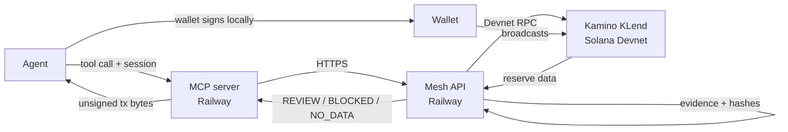

# FalconOS

FalconOS is the umbrella product. Its current module, Falcon Investment Council, is agent-first market intelligence and risk advisory. The live MVP is an MCP plugin and a Solana Devnet USDC yield agent. The agent connects to Kamino's KLend program on Devnet, reads reserve data, produces a hashed evidence record, evaluates a supply or redeem proposal against user-defined limits, and returns an unsigned transaction. The user's or agent's own wallet signs and broadcasts. Falcon never holds keys, never broadcasts, and never moves real funds. There is no mainnet deployment and no custody. No signed Devnet transaction has been completed yet: the live end-to-end check verified wallet sign-in, evidence capture, a REVIEW decision, and correct rejection of an unfunded wallet; a signed supply has not been confirmed on chain.

## Try it

**Agent page:** [https://agents.falconos.markets](https://agents.falconos.markets)

**Download the skill (any agent):**
```sh
curl -fsSL https://agents.falconos.markets/SKILLS.md
```

**Claude Code:**
```sh
claude mcp add --transport http falconos https://mcp.falconos.markets/mcp
```

**JSON config** (any MCP client that supports Streamable HTTP):
```json
{
  "mcpServers": {
    "falconos": {
      "type": "http",
      "url": "https://mcp.falconos.markets/mcp"
    }
  }
}
```

## How it works



Wallet sign-in is an Ed25519 message signature in SIWS style. It does not create a transaction and has no fee. The MCP server is stateless. Sessions live in the Mesh database: Supabase Postgres, schema v3. Mesh and the MCP server run on Railway.

## Solana integration

Falcon has no custom on-chain program. It uses Kamino's existing KLend program on Devnet.

| Name | Address |
| ---- | ------- |
| KLend program | `KLend2g3cP87fffoy8q1mQqGKjrxjC8boSyAYavgmjD` |
| Devnet USDC mint | `4zMMC9srt5Ri5X14GAgXhaHii3GnPAEERYPJgZJDncDU` |
| Reserve | `HRwMj8uuoGVWCanKzKvpTWN5ZvXjtjKGxcFbn2qTPKMW` |
| Market | `6aaNTBEmwdN19AAdTwbNrWyUo6iEyiLguxCTePEzSqoH` |

**Signing boundary:** Mesh reads reserve accounts over Devnet RPC and records evidence with hashes. It evaluates user-defined limits and returns `REVIEW`, `BLOCKED`, or `NO_DATA`. It prepares an unsigned Kamino supply or redeem transaction. Supply is capped at 1 Devnet USDC and requires a fresh `REVIEW` decisionId. Redeem does not require a decisionId. The user's wallet or the agent's own wallet signs and broadcasts. Falcon never holds a private key and never broadcasts.

## MCP tools

The server exposes 10 tools. Every authenticated tool requires `session` as an argument.

| Tool | What it does |
| ---- | ------------ |
| `falcon_connect` | Starts wallet sign-in. Returns a message to sign. |
| `falcon_connect_verify` | Takes the signature (64 bytes, base64 or base58). Returns a 30-minute `session`. |
| `falcon_disconnect` | Revokes the session. |
| `falcon_yield_opportunities` | Reads yield opportunities. Read-only. |
| `falcon_refresh_evidence` | Captures the three Devnet connectors and creates the live analysis. Returns `analysisId`. |
| `falcon_reserve_decision` | Returns REVIEW, BLOCKED or NO_DATA for a proposed supply. REVIEW is not approval. |
| `falcon_prepare_transaction` | Prepares an unsigned Devnet supply or redeem. Supply needs `decisionId`; redeem forbids it. |
| `falcon_submit_signed` | Registers wallet-signed bytes. Falcon never broadcasts. |
| `falcon_check_receipt` | Reconciles the transaction against Devnet. |
| `falcon_activity` | Joins recent decisions and prepared transactions into one trail. Read-only. |

Amounts are decimal USDC strings with at most 6 decimals, for example `"0.5"`. They convert to base units with BigInt, not floats.

## Status and limits

- **Devnet only.** No mainnet deployment. No real funds.
- **No custody.** Falcon never holds keys. The agent signs and broadcasts its own bytes.
- **Sessions expire after 30 minutes.** Call `falcon_disconnect` to revoke early.
- **Evidence is short-lived.** Captured evidence is usable for about 300 seconds. A prepared transaction expires in about 120 seconds.
- **Supply cap.** Mesh caps Devnet supply at 1 USDC.
- **No OAuth on the MCP endpoint.** All data access requires a valid wallet session. All write actions require the wallet's own signature.

## Run locally

Node 24.12 or later is required.

```sh
# Install packages
npm --prefix mesh ci
npm --prefix mcp ci
npm --prefix web ci

# Set up Postgres for Mesh
createdb falcon_mesh
export DATABASE_URL='postgresql://localhost/falcon_mesh'
FALCON_MESH_ALLOW_SCHEMA_SETUP=1 npm --prefix mesh run init-db

# Terminal 1: Mesh API
npm --prefix mesh run dev:local           # 127.0.0.1:8791

# Terminal 2: MCP server
FALCON_MESH_API_URL=http://127.0.0.1:8791 \
FALCON_MCP_ORIGIN=http://127.0.0.1:5173 \
npm --prefix mcp start                    # 127.0.0.1:8792

# Terminal 3: bot page
npm --prefix web run dev:bot              # 127.0.0.1:5194
```

Add the local MCP server to Claude Code:

```sh
claude mcp add --transport http falconos http://127.0.0.1:8792/mcp
```

See [mesh/README.md](mesh/README.md) and [mcp/README.md](mcp/README.md) for full configuration details and database prerequisites.

## Repository layout

| Path | Purpose |
| ---- | ------- |
| `mcp/` | MCP server (Streamable HTTP, stateless, Railway) |
| `mesh/` | Mesh API and Kamino adapter (Railway, Supabase Postgres schema v3) |
| `web/` | Bot page (`web/bot`), skill template (`web/skills/SKILLS.md`), site, dashboard |
| `engine/` | Rust stocks dashboard |
| `src/` | Advisory plugin CLI |
| `docs/` | Architecture, interfaces, verification records |
| `SPEC.md` | Product specification |
| `status.md` | Current work and decisions |

## Verification

**Tests:** MCP 45/45, web focused 52/52, Mesh Kamino 18/18.

**CI:** `.github/workflows/ci.yml` builds and smokes Mesh and MCP containers.

**Live end-to-end check against the hosted MCP with a generated wallet:**

- 10 tools listed.
- Wallet sign-in succeeded.
- Opportunities returned with status READY.
- Devnet evidence captured with status OBSERVED.
- Decision returned REVIEW with five PASS checks: evidence, freshness, owner_cap, book_floor, proposal_vs_book.
- Unsigned prepare correctly refused an unfunded wallet: `Wallet has no Devnet USDC token account.`
- Activity and disconnect worked.
- No signed Devnet transaction has been completed yet.

---

[SPEC.md](SPEC.md) | [status.md](status.md) | [docs/README.md](docs/README.md) | [mcp/README.md](mcp/README.md)
