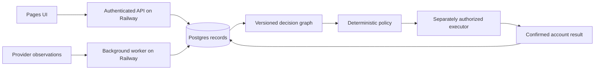

# ADR 0004: Separate public access from server execution

[VERIFIED, user request] Date: 2026-09-26. Owner: architect. Status: Planned. The user requested a future cloud path so other people can test the MVP. This request authorizes deployment research. It does not authorize publication.

## Options

| Option | Use |
| --- | --- |
| Cloudflare Pages | [INFERRED, recommendation now] Serve the static treasury simulation over HTTPS. Each tester keeps browser-local state. |
| Pages plus Railway and Postgres | [INFERRED, recommendation later] Keep the UI on Pages. Add an authenticated API, durable observations, and a worker when server execution is required. |
| Workers, Durable Objects, and Queues | [REPORTED, researcher] A viable event-driven alternative. It requires a different runtime, coordination, and storage design. |

## Recommended first public release

[VERIFIED, local hosting record] `web/README.md` names root `web`, build command `npm run build`, and output `dist`. Current remote project settings were not checked in this task.

[VERIFIED, official documentation] [Pages build configuration](https://developers.cloudflare.com/pages/configuration/build-configuration/) supports build commands, roots, and output directories. The [Web Locks documentation](https://developer.mozilla.org/en-US/docs/Web/API/Web_Locks_API) requires a secure context. Public testing should use HTTPS.

[INFERRED, release design] Build the `/treasury/` entry as part of the existing Pages artifact. Verify the actual project and branch before publication. Preserve existing Functions and bindings. Check the route title and workflow rather than accepting HTTP 200 alone. An isolated browser must start with its own empty simulation.

[INFERRED, public test boundary] Static hosting shares the app, not a user's saved simulation. Closing the tab stops the agent loop. Public hosting requires no new database for this slice. The concrete release candidate comes before publication approval.

## Later server architecture

[INFERRED, future design]

[INFERRED, migration trigger] Add the backend when users need cross-device state, private provider credentials, or operation after the browser closes. Define authentication, per-user isolation, idempotency, reconciliation, backups, and recovery before moving financial state there. The browser remains an untrusted client.

[VERIFIED, Railway documentation] [Postgres](https://docs.railway.com/databases/postgresql) provides `DATABASE_URL` connection configuration. [Serverless](https://docs.railway.com/deployments/serverless) can sleep inactive services. [Healthchecks](https://docs.railway.com/deployments/healthchecks) run during deployment; they do not continuously monitor the live service.

[INFERRED, operational choice] Disable sleeping for a continuous worker. Configure backups and ongoing monitoring separately. The exact service runtime, database schema, region, and costs remain unselected. No migration, infrastructure account, or resource is created by this decision.

## Least confident decisions

1. [INFERRED] Railway is the preferred next service host, but measured workload and cost may favor a Cloudflare design.
2. [INFERRED] Existing Pages settings can support the preview. They must be checked against the real project before deployment.
3. [INFERRED] The eventual executor's custody and permission model needs a separate reviewed design.
