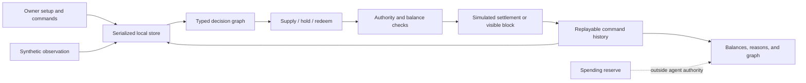

# Falcon treasury MVP

[VERIFIED, user direction, 2026-09-26] The user accepted [the visual pitch](pitches/falcon-stages.html), requested the spec and MVP, and selected the local loop first.

## Product outcome

[INFERRED, product design] An individual sets aside spending cash and gives Falcon a separate investment budget. Falcon uses current evidence and the user's rules to propose supply, hold, or redemption. The user can inspect why the action occurred and what happened afterward.

[INFERRED, first market] Start with one native-USDC lending position on Solana. Kamino is a candidate. Several venues, other chains, securities, flash loans, borrowing, and pooled investor funds are outside this MVP. No yield advantage has been established.

[INFERRED, scope correction] An earlier draft called borrowing and pooled investor funds planned later scope. The accepted pitch does not establish that commitment. Later work still needs its own product decision.

## First usable slice

[VERIFIED, user choice] Build the local simulation before a protocol integration. [INFERRED, delivery boundary] This slice demonstrates the product loop. It is not the complete Stage 01 funded MVP.

1. [INFERRED] The user enters simulated total cash, a protected reserve, and an investment cap. Separate undelegated cash remains outside the agent's budget.
2. [INFERRED] A synthetic observation enters the graph with its source, time, and available liquidity. The graph carries the mandate and current balances.
3. [INFERRED] The decision reads that graph. A valid action changes only delegated simulated balances. A blocked or unavailable result preserves the position.
4. [INFERRED] The app saves the command before showing success. Reload reconstructs the graph, decisions, and outcomes. Export preserves a replayable JSON record.

[INFERRED, simulation model] Fees and interest are zero. The pool is synthetic. The first loop neither calls an LLM nor makes a protocol request. A graph-shaped rule engine proves the control path before a model can propose actions.

## Architecture

[INFERRED, local architecture]

[INFERRED, code boundary] Pure domain logic lives in `web/treasury/domain.mjs`. The local store owns persistence. The UI invokes those modules and renders their outputs. The existing Rust advisory engine, plugin, and Devnet terminal retain their contracts. See [I14](treasury-contract.md).

## Complete Stage 01 gate

[INFERRED, required next work] The full MVP requires one verified supply and redemption path, actual receipt ownership, confirmed balance reconciliation, and tested authority limits. A browser decision is never sufficient authority for a real transaction.

[REPORTED, integration researcher, 2026-09-26] Kamino's current [lending checks](https://raw.githubusercontent.com/Kamino-Finance/klend/master/programs/klend/src/lending_market/lending_checks.rs) include `CTokenUsageBlocked`. The selected reserve must permit direct cToken use. Otherwise, evaluate a supply-only obligation path. A usable public Devnet USDC reserve is not established by this research.

[INFERRED, next proof] Use a local Solana fork with synthetic test balances to test real protocol instructions. Confirm reserve configuration, token identity, receipt owner, redemption rounding, and reconciliation. Keep owner signatures first. Add restricted agent authority as a separate proof.

## Success criteria

| Gate | Evidence required |
| --- | --- |
| Local loop | [INFERRED] Setup, graph-based supply, hold, visible failed exit, owner redemption, and replay after reload. |
| Protected money | [INFERRED] Exact conservation tests. Reserve and undelegated funds cannot be debited by agent cycles. |
| Honest failure | [INFERRED] Stale data, revocation, malformed records, and failed storage writes cannot show successful settlement. |
| Tester access | [INFERRED] HTTPS static preview, separate browser histories, working mobile and keyboard controls. |
| Funded Stage 01 | [INFERRED] Protocol and delegation proofs plus a reviewed customer launch scope. Still pending. |

## Least confident decisions

1. [INFERRED] Users may want a different reserve and budget flow after trying the simulation.
2. [INFERRED] Kamino reserve selection and permission constraints may change the lending adapter.
3. [INFERRED] Browser-local history is sufficient for early tests, but cannot provide cross-device state or an agent that runs continuously.
